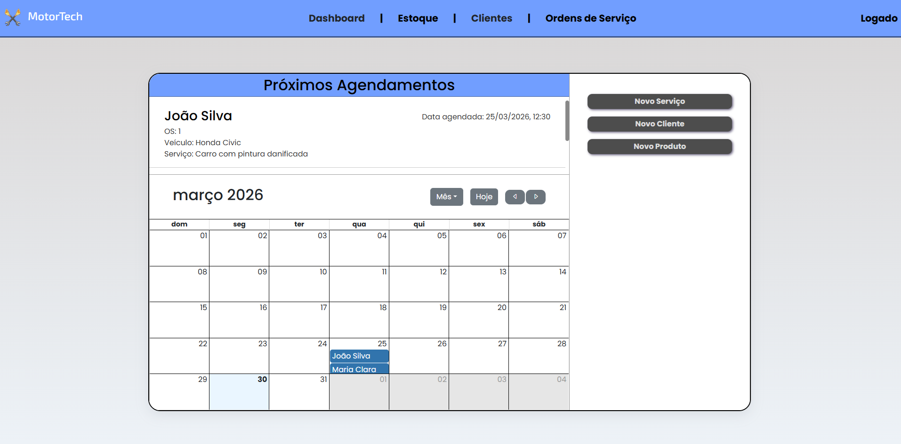

# MotorTech - Sistema de Gestão para Oficinas

Este é um painel administrativo desenvolvido para facilitar o dia a dia de oficinas mecânicas e auto centers. O foco do sistema é centralizar e gerenciar as informações da oficina como agendamentos, clientes, estoque e ordens de serviço de forma simples, visual e eficiente.

## Sobre o Projeto

Este projeto foi criado com o objetivo de estudo e prática. Estou usando esse projeto como um laboratório real para me desenvolver na área de programação Full Stack. Aqui, o foco é aplicar conceitos do mercado, desde a criação da interface e experiência do usuário no Front-end, até a construção de toda a lógica, servidor e banco de dados no Back-end para o sistema funcionar de ponta a ponta.



## 💻 Tecnologias Utilizadas

**Front-end**
* React + Vite
* CSS Modules
* JavaScript (JSX)
* React Big Calendar
* Bootstrap Icons

**Back-end**
* Node.js + Express.js
* Prisma ORM
* PostgreSQL (NeonDB)

**Deploy**
* Frontend: Vercel
* Backend: Render

## Funcionalidades Atuais

* Navegação entre as páginas do painel estruturada.
* Tela principal (Dashboard) com visual limpo e responsivo.
* Calendário interativo com múltiplos modos de visualização (mês, semana, dia e agenda), integrado ao backend para exibir os agendamentos reais da oficina.
* Lista inteligente que exibe os próximos agendamentos organizados automaticamente pela data mais próxima.
* Tela de Clientes com listagem (em aprimoramento).
* Backend completo com API REST estruturada em Express.js, cobrindo as entidades Cliente, Veículo, Produto, Ordem de Serviço, Itens e Serviços da OS.
* Banco de dados relacional modelado com Prisma e hospedado no NeonDB.

## Próximos Passos

- [ ] Aprimoramento da tela de Clientes
- [ ] Criação das telas de Produtos e Estoque
- [ ] Criação das telas de Ordens de Serviço
- [ ] Formulários de criação de Produto e OS
- [ ] Implementação de autenticação (login)

## 🌐 Acesse o Sistema

O frontend está disponível em: https://projeto-oficina-kappa.vercel.app/

---

## Como Executar Localmente

Se você deseja rodar este projeto na sua máquina para estudos ou testes, siga os passos abaixo:

### 1. Front-end

Abra o terminal e execute:

```bash
cd GestaoOficina
npm install
npm run dev
```
2. Back-end
Abra uma nova aba no terminal e execute:

```Bash
cd GestaoOficinaAPI
npm install
npm run dev
```

Aviso: Lembre-se de criar um arquivo .env na pasta GestaoOficinaAPI contendo a sua DATABASE_URL de conexão com o PostgreSQL para que o Prisma consiga se comunicar com o banco de dados.
